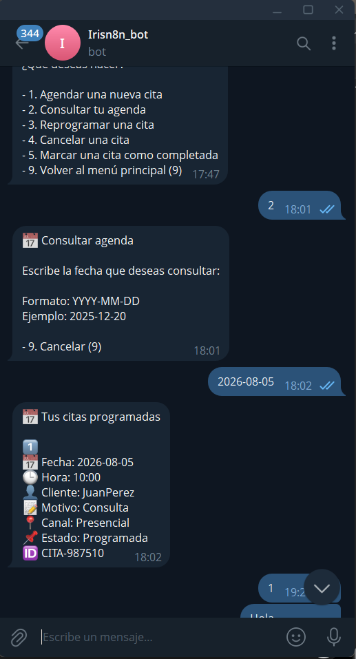
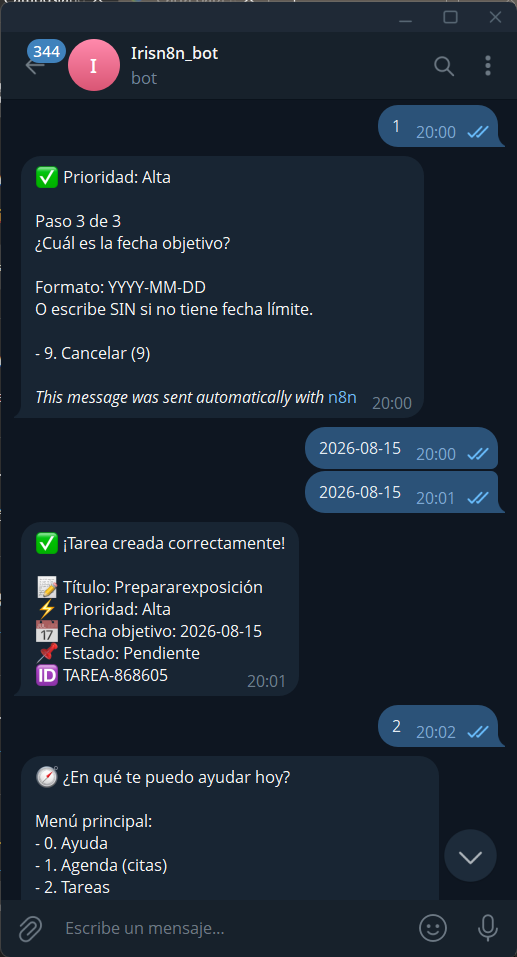
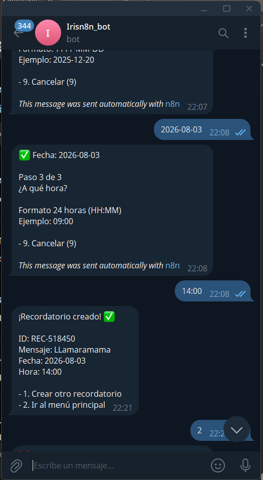
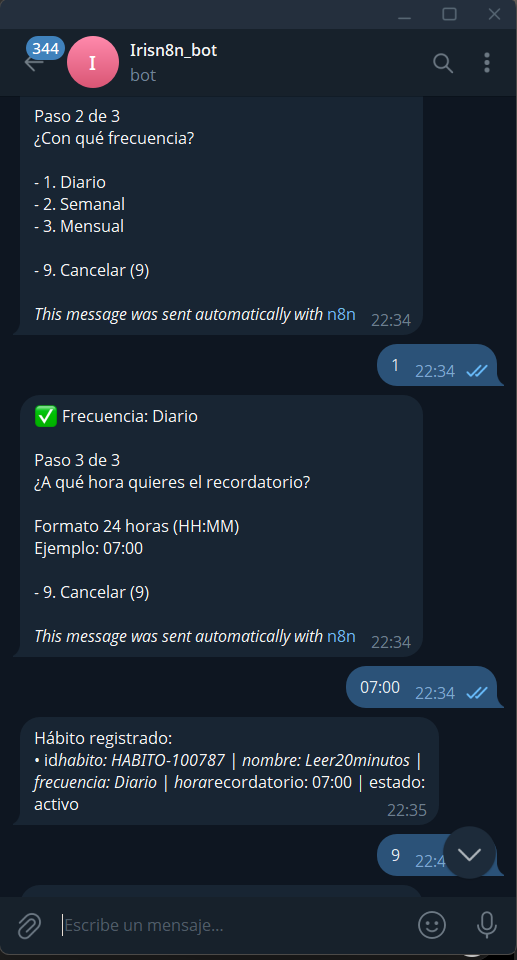
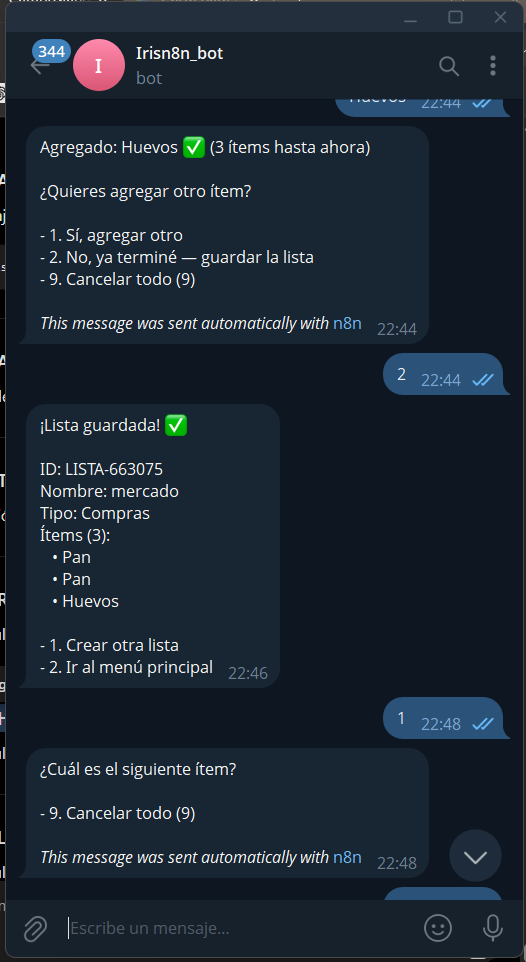
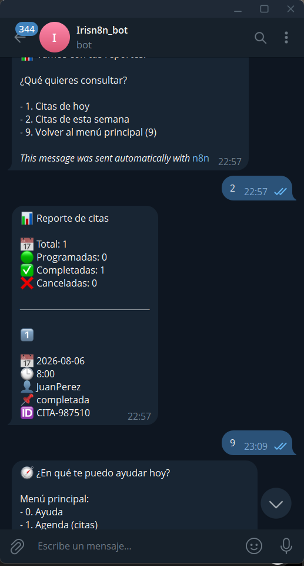
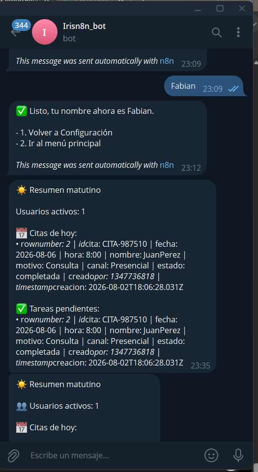
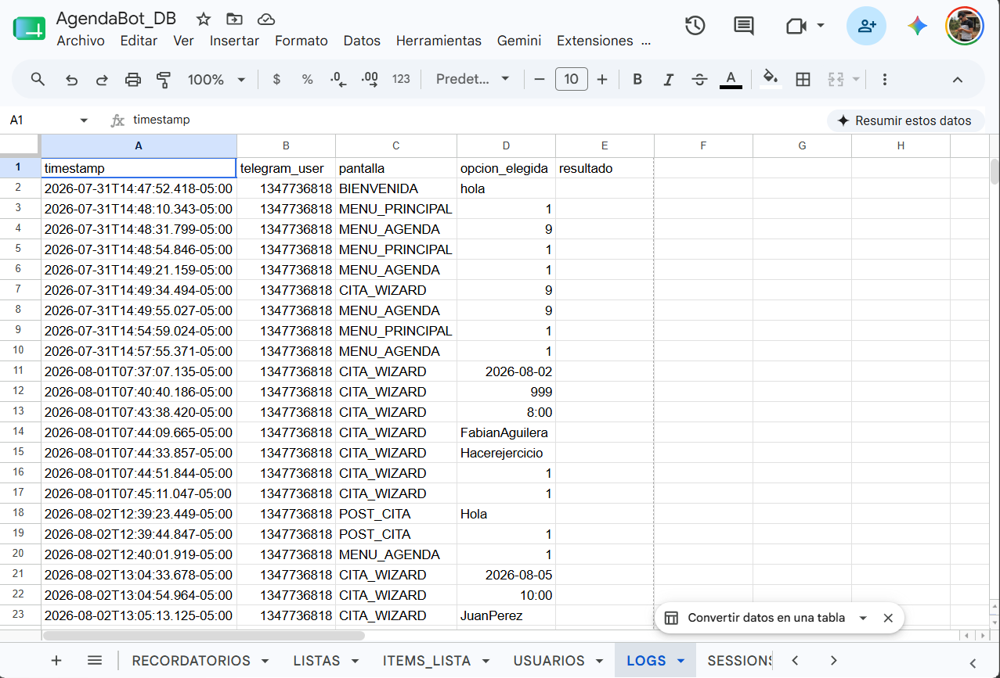
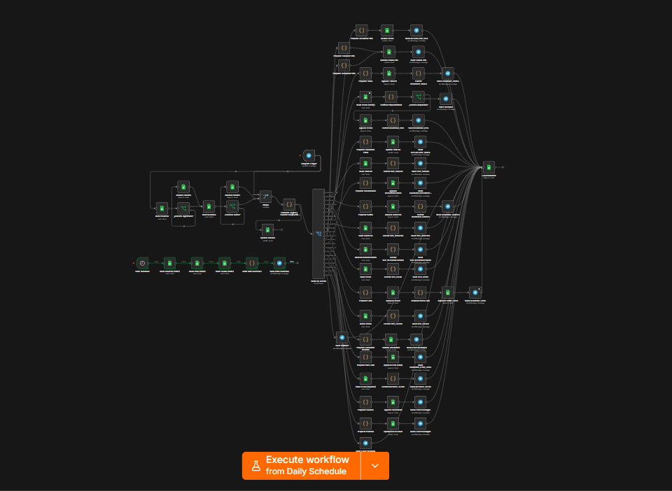

# 📸 Evidencias del Proyecto AgendaBot

En esta carpeta se presentan las evidencias del funcionamiento de **AgendaBot**, desarrolladas durante la implementación del proyecto **Proyecto IA Nivel 1**.

---

# 1. Menú Principal

Demuestra el mensaje de bienvenida, la navegación por menús numéricos y la orientación al usuario.

---

# 2. Gestión de Agenda

Registro exitoso de una nueva cita mediante el flujo guiado.

Consulta de las citas registradas.

---

# 3. Gestión de Tareas

Creación y actualización del estado de tareas.

---

# 4. Gestión de Recordatorios

Registro y consulta de recordatorios.

---

# 5. Gestión de Hábitos

Registro y consulta de hábitos.

---

# 6. Gestión de Listas

Creación y consulta de listas e ítems.

---

# 7. Reportes

Generación del reporte de citas del usuario.

---

# 8. Administración

Registro de usuarios y gestión de permisos.

---

# 9. Resumen Diario

Automatización ejecutada mediante Schedule Trigger.

---

# 10. Registro de Logs

Registro automático de las interacciones almacenadas en Google Sheets.

---

# 11. Workflow implementado

Vista general del workflow desarrollado en n8n.

---

## Conclusión

Las evidencias presentadas demuestran el funcionamiento de las principales funcionalidades implementadas en AgendaBot, incluyendo la navegación conversacional, la gestión de información, las automatizaciones y el almacenamiento mediante Google Sheets, cumpliendo con los requerimientos establecidos para el Proyecto IA Nivel 1.
